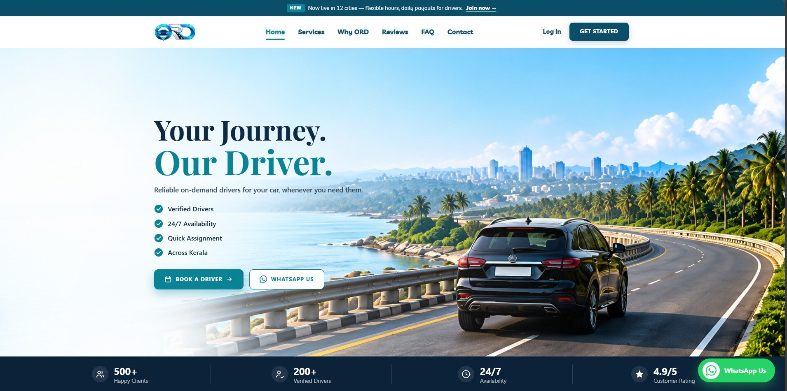

# 🚗 On Road Driver (ORD)

> On-demand professional driver service in Kerala.

<p align="center">
  <a href="https://naveenkrishnanpersonal.github.io/On-Road-Driver/">
    
  </a>
</p>

<p align="center">
  <a href="https://naveenkrishnanpersonal.github.io/On-Road-Driver/">
    
  </a>
  
  
  
</p>

## 📌 About the Project

**On Road Driver (ORD)** is a modern, responsive single-page marketing website for an on-demand professional driver service in Kerala.

The website allows visitors to explore available services and quickly connect for driver bookings through pre-filled WhatsApp interactions.

The project focuses on:

- Clean and modern UI
- Responsive desktop and mobile layouts
- Clear service presentation
- Direct booking actions
- Fast and accessible navigation
- Professional business-focused design

---

## ✨ Features

- 🚗 Hourly driver booking
- 🌙 Full-day driver service
- ✈️ Airport transfer service
- 🛣️ Outstation trips
- 💬 WhatsApp booking integration
- 📞 Click-to-call contact options
- 📧 Email contact integration
- 📍 Location/map integration
- ❓ FAQ accordion
- 📱 Responsive mobile menu
- 🔄 Scroll-spy navigation
- ⭐ Customer reviews section
- 🟢 Floating WhatsApp booking button

---

## 🖥️ Live Demo

### 🌐 [Visit On Road Driver Website](https://naveenkrishnanpersonal.github.io/On-Road-Driver/)

---

## 🛠️ Tech Stack

| Technology | Usage |
|---|---|
| React 19 | User interface |
| Vite | Development & build tooling |
| JavaScript | Application logic |
| CSS | Styling & responsive design |
| HTML5 | Page structure |
| GitHub Pages | Deployment |

---

## 📂 Project Structure

```text
On-Road-Driver/
├── public/
│   └── preview.jpg
├── src/
│   ├── components/
│   ├── assets/
│   └── ...
├── .github/
│   └── workflows/
├── index.html
├── package.json
├── package-lock.json
├── vite.config.js
├── README.md
└── LICENSE
A responsive, single-page website for **On Road Driver (ORD)** — an on-demand
driver service in Kerala. A visitor can hire a driver for their car by the
hour, the full day, an airport transfer or an outstation trip, straight from a
pre-filled WhatsApp chat.

Built with React 19 and Vite. No CSS framework — each section ships its own
plain CSS file.

## What's on the page

- Hero with trip pricing and live WhatsApp booking links
- Services, why-choose-us, about, customer reviews and an FAQ accordion
- Contact tiles (call, WhatsApp, email, map) with a floating WhatsApp button
- Scroll-spy navigation, accessible accordion, and a mobile menu

## Stack

- [React 19](https://react.dev)
- [Vite](https://vite.dev)
- [Oxlint](https://oxc.rs)

## Getting started

```bash
npm install
npm run dev
```

The dev server prints a local URL (usually <http://localhost:5173>).

## Scripts

| Command           | What it does                       |
| ----------------- | ---------------------------------- |
| `npm run dev`     | Start the dev server with HMR      |
| `npm run build`   | Production build into `dist/`      |
| `npm run preview` | Serve the built output locally     |
| `npm run lint`    | Run Oxlint over the project        |

## Project structure

```
public/            Static assets (logo, illustrations, icons, manifest, sitemap)
src/
  components/      One component + CSS file per page section
  site.js          Contact details and the WhatsApp link helper
  asset.js         Deployment-base helper for runtime image paths
  App.jsx          Section order for the page
  index.css        Design tokens and global styles
  main.jsx         React entry point
```

## Configuration

Contact details and the WhatsApp number live in `src/site.js`. Update them
there and every button, contact tile and footer link follows.

> The phone number, email and address currently shipped are placeholders.
> Replace them before going live.

## SEO

Everything Google needs to index the page is already wired up:

- Keyword-rich `<title>`, description and `og:` tags in `index.html`
- `LocalBusiness` JSON-LD structured data for rich results
- `public/robots.txt` pointing at `public/sitemap.xml`
- Descriptive `alt` text on every image and a single keyword `<h1>`

Before launch, change the domain in `index.html` (canonical, `og:url`,
`og:image`, JSON-LD) and in `public/robots.txt` + `public/sitemap.xml` to your
own URL, then submit the sitemap in [Google Search Console](https://search.google.com/search-console).

## Deployment

`npm run build` emits a static site to `dist/`. The build uses a relative base
(`./`), so it can be served from a domain root or from a subpath — for example
a GitHub Pages project site at `https://<user>.github.io/<repo>/` — without
further configuration.

## License

[MIT](LICENSE)
